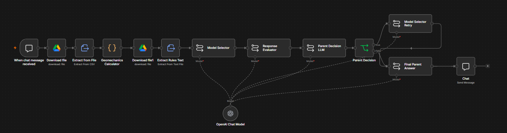

# AI-Powered Reservoir Rock Physics Model Selector

This repository contains an n8n workflow for depth-based geomechanical analysis and rock physics model selection.

The workflow receives a user request through chat, extracts one or more requested depths, finds the nearest matching depth from a CSV dataset, calculates key geomechanical properties, and uses a multi-step LLM evaluation process to recommend the most defensible rock physics model.

## Run the Workflow

Click the link below to open the hosted n8n chat and run the workflow:

[Run the Reservoir Rock Physics Workflow](https://yahyamoha.app.n8n.cloud/webhook/5beefa9e-ff41-4bf2-8339-2b093096fccd/chat)

Example inputs:

- `analyze 1050`
- `compare 1050 and 1090`

## Overview

The workflow is designed for reservoir geomechanics and rock physics interpretation. It combines:

- CSV-based well log data
- JavaScript-based geomechanical calculations
- Rock physics model selection rules
- LLM-based model recommendation
- LLM-based response evaluation
- Parent decision logic
- Retry logic
- Final user-facing interpretation
- GitHub README creation/update through n8n

The system is built to avoid unsupported assumptions and clearly report missing geological, fluid, mineralogical, and rock texture information.

## Workflow Purpose

The main goal of this workflow is to answer user questions such as:

- `analyze 1050`
- `compare 1050 and 1090`

For each requested depth, the workflow:

1. Extracts the depth value from the user message.
2. Finds the nearest matching depth in the CSV dataset.
3. Calculates geomechanical properties.
4. Selects a suitable rock physics model.
5. Evaluates the recommendation.
6. Decides whether the recommendation should be accepted or retried.
7. Produces a final interpretation for the user.

## Workflow Structure

The workflow follows this structure:

- Chat Trigger
- Download CSV file
- Extract CSV data
- Geomechanics Calculator
- Download rules TXT file
- Extract Rules Text
- Model Selector LLM
- Response Evaluator LLM
- Parent Decision LLM
- IF Decision
  - Retry path: Model Selector Retry → Final Parent Answer
  - Accept path: Final Parent Answer
- Chat Response

## Workflow Diagram

Click the image below to view the full n8n workflow.

## Main Nodes

### Chat Trigger

The workflow starts when a chat message is received from the user.

Example inputs:

- `analyze 1050`
- `compare 1050 and 1090`

The workflow extracts all numeric depth values from the user message.

### CSV Data Download and Extraction

The workflow downloads a CSV file containing reservoir and geomechanical log data.

The CSV may include fields such as:

| Column | Description |
|---|---|
| `depth_m` | Depth in meters |
| `density_g_cc` | Density in g/cc |
| `porosity_percent` | Porosity percentage |
| `vp_m_s` | Compressional wave velocity |
| `vs_m_s` | Shear wave velocity |
| `lithology` | Lithology description |
| `fluid_type` | Fluid type |
| `water_saturation_percent` | Water saturation |
| `gas_saturation_percent` | Gas saturation |
| `clay_volume_percent` | Clay volume |
| `quartz_fraction_percent` | Quartz fraction |
| `cementation_level` | Cementation level |
| `fracture_intensity` | Fracture intensity |
| `grain_contact_evidence` | Evidence of grain-contact behavior |
| `effective_pressure_MPa` | Effective pressure |
| `temperature_C` | Temperature |
| `analysis_objective` | Analysis objective |

### Geomechanics Calculator

The `Geomechanics Calculator` node is a JavaScript code node.

It performs the following operations:

1. Reads the original user message.
2. Extracts requested depth values.
3. Reads the extracted CSV rows.
4. Finds the nearest available CSV depth for each requested depth.
5. Calculates geomechanical properties.
6. Sends the calculated result to the model selection stage.

## Calculated Properties

For each requested depth, the workflow calculates:

| Property | Formula / Description |
|---|---|
| Density conversion | `density_g_cc × 1000 = kg/m³` |
| Shear Modulus | `G = ρ × Vs²` |
| Poisson's Ratio | `ν = (Vp² - 2Vs²) / [2(Vp² - Vs²)]` |
| Young's Modulus | `E = 2G(1 + ν)` |
| Bulk Modulus | `K = E / [3(1 - 2ν)]` |
| Vp/Vs Ratio | `Vp / Vs` |

The output includes:

- Requested depth
- Matched CSV depth
- Depth difference
- Input log values
- Geological context
- Advanced model inputs
- Calculated elastic properties

## Rock Physics Model Selection

The `Model Selector` LLM receives:

1. The original user request
2. The geomechanical calculation output
3. The rock physics model selection rules from the TXT file

It then selects the most defensible model from the available choices:

- Gassmann Model
- Contact Theory / Hertz-Mindlin
- Effective Medium Models
- Xu-White Model

The model selection is based on:

- Density
- Porosity
- Vp
- Vs
- Vp/Vs ratio
- Young's modulus
- Bulk modulus
- Shear modulus
- Poisson's ratio
- Available geological and fluid information
- Missing-data limitations

## Model Selection Logic

The workflow follows rule-based interpretation logic.

General examples:

- If only density, porosity, Vp, and Vs are available, the workflow treats the recommendation as preliminary.
- If the data is limited and the rock contains mixed phases or uncertain composition, Effective Medium Models may be the safest first-pass option.
- If fluid substitution is requested and fluid/saturation data exists, Gassmann may be appropriate.
- If the rock appears weak, unconsolidated, or grain-contact dominated, Contact Theory / Hertz-Mindlin may be considered.
- If clay volume or shale content is available, Xu-White may be considered.

The workflow is designed not to invent missing lithology, saturation, fluid type, clay content, mineralogy, cementation, fracture information, pressure, or temperature.

## Response Evaluation

After the first model recommendation, the `Response Evaluator` LLM critically checks whether the recommendation is consistent with:

- The calculated geomechanical properties
- The input log values
- The model selection rules
- Missing-data limitations

The evaluator returns:

- Consistency check
- Main risk
- Missing data
- Confidence level
- Verdict: Accept, Modify, or Reject
- Recommendation on whether the parent should retry

## Parent Decision Logic

The `Parent Decision LLM` decides whether to accept the first model recommendation or request one final retry.

It outputs one of:

- `DECISION: ACCEPT`
- `DECISION: RETRY`

The parent chooses `ACCEPT` when the model is defensible as a preliminary or reliable recommendation.

The parent chooses `RETRY` when the model selection is unsupported, inconsistent with the rules, overconfident, or based on assumptions that are not supported by the data.

## Retry Path

If the parent decision is `RETRY`, the workflow calls the `Model Selector Retry` node.

This is the second and final model selection attempt.

The retry node receives:

- Original geomechanical calculation output
- Rock physics rules
- First model selector output
- Response evaluator feedback
- Parent decision feedback

It then revises or confirms the model recommendation.

## Final Parent Answer

The `Final Parent Answer` node produces the final user-facing interpretation.

The final answer includes:

1. Requested depth or depths
2. Matched CSV depth or depths
3. Key input logs
4. Calculated geomechanical properties
5. Selected rock physics model
6. Reason for model selection
7. Evaluation summary
8. Confidence level
9. Missing data and limitations
10. Final recommendation

## Technologies Used

- n8n
- JavaScript Code Node
- GitHub Node
- Google Drive Node
- CSV extraction
- TXT rule extraction
- OpenAI Chat Model
- LLM-based evaluation and decision logic

## Key Features

- Chat-based depth input
- Automatic depth extraction from natural language
- Nearest-depth matching from CSV data
- Geomechanical property calculation
- Rule-guided rock physics model selection
- Independent LLM evaluation
- Parent decision control
- Retry mechanism for weak or unsupported recommendations
- Final structured interpretation
- Hosted n8n chat interface
- GitHub README creation/update through n8n

## Data Requirements

Minimum useful CSV inputs:

- Depth
- Density
- Porosity
- Vp
- Vs

Recommended additional inputs:

- Lithology
- Fluid type
- Water saturation
- Gas saturation
- Clay volume
- Quartz fraction
- Cementation level
- Fracture intensity
- Grain contact evidence
- Effective pressure
- Temperature
- Mineral moduli
- Dry frame properties
- Fluid bulk modulus

More geological and petrophysical information improves confidence.

## Limitations

This workflow provides a rule-guided, first-pass geomechanical and rock physics interpretation.

It should not be treated as a final reservoir characterization result without expert validation.

Important limitations:

- It depends on the quality of the input CSV data.
- It uses nearest-depth matching, not interpolation.
- It does not invent missing geological information.
- Confidence is reduced when lithology, fluid, saturation, mineralogy, cementation, fracture, pressure, or temperature data is missing.
- Final interpretation should be reviewed by a qualified geoscience or reservoir engineering specialist.

## Repository Use Case

This project is useful for:

- Reservoir geomechanics screening
- Educational rock physics workflows
- Comparing candidate rock physics models
- Testing LLM-based scientific decision workflows
- Automating structured interpretation from well log data

## Author

Created by Yahya.